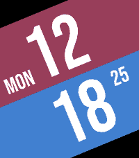
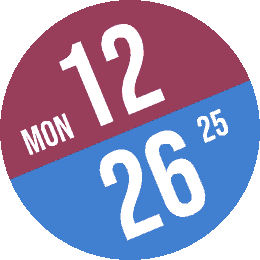

# Pebble Faceoff Watchface

A Pebble watchface inspired by "versus" screens.

## Screenshots

## Build

You must have [`just`](https://github.com/casey/just) and the [Pebble SDK](https://developer.repebble.com/sdk/) installed. This was built on version 4.9.148 of the SDK, but newer versions are likely still supported.

Once installed, you can run `just build` to build the pbw file.

Compiled versions of the fonts for fctx are included, but if you wish to recompile it, you can use `just compile_font`.
